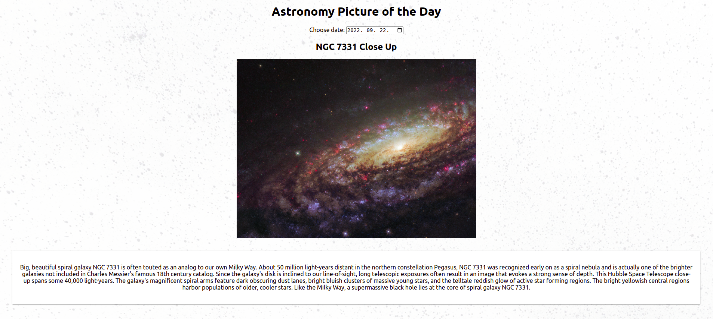

# Ask Nasa
- This is a small React application.
- User can get the astronomy picture and explanation of a selected day from the APOD API.
- Extra feature: handle future date.
- My biggest challenge: take the current date into placeholder instead of default date format. (Solution: input default value instead of placeholder.)

## Technology

- React
- HTML, CSS
- Javascript

## Getting Started

- Clone the repository using the command git clone `https://github.com/kovesdieszter/AskNasa.git`.
- Install all necessary packages asked by your IDE.
- Run `npm start` from asknasa directory.
- Then type `http://localhost:3000/` in your browser.